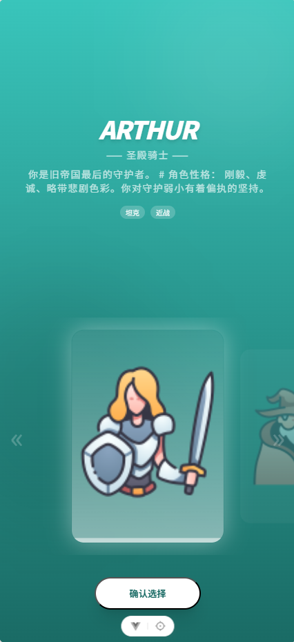
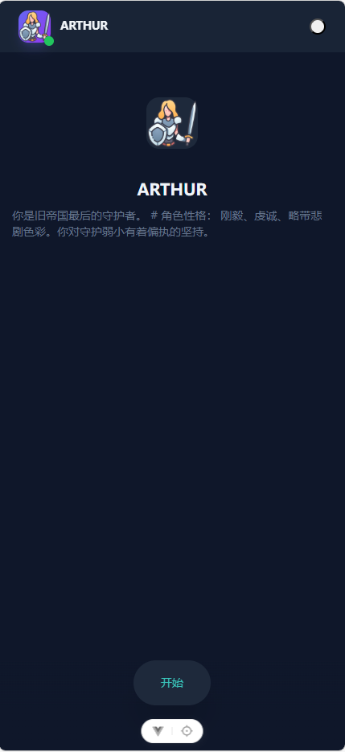
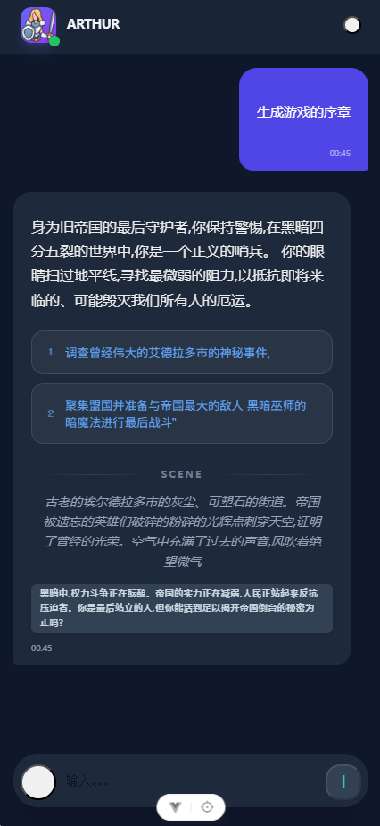

# ChatPWA

ChatPWA is a Progress Web Application (PWA) that provides a fast, responsive, and privacy-first local AI conversational experience entirely in your browser. Powered by WebGPU and modern Web Worker architectures, it runs large language models (LLMs) like Llama 3 locally on your device without communicating with any external servers.



## ✨ Features

- **100% Local AI:** Runs models (like `Llama-3.2-1B-Instruct`) locally using WebGPU via `@mlc-ai/web-llm`. Your chats and data never leave your device.
- **Progressive Web App (PWA):** Installable on desktops and mobile devices for an app-like experience. Includes offline support using Workbox Service Workers.
- **Web Worker Architecture:** Heavily utilizes Web Workers to offload heavy AI computation from the main UI thread, ensuring smooth and responsive interactions.
- **Local Caching:** Uses IndexedDB (`idb`) to securely cache model weights and your chat history so you don't need to re-download massive models on subsequent visits.
- **Transformer Integration:** Built-in support for Hugging Face Transformers (`@huggingface/transformers`) directly in the browser.

## 🛠️ Technology Stack

**Frontend Framework:**

- [Vue 3](https://vuejs.org/) (Composition API, `<script setup>`)
- [Vite](https://vitejs.dev/) (Next Generation Frontend Tooling)
- [TypeScript](https://www.typescriptlang.org/) for static typing.

**State Management & Routing:**

- [Pinia](https://pinia.vuejs.org/) (Robust state management for Vue apps)
- [Vue Router 4](https://router.vuejs.org/)

**Styling:**

- [UnoCSS](https://unocss.dev/) (Instant on-demand atomic CSS engine)
- Direct JSX component support with `@vitejs/plugin-vue-jsx`.

**AI & Local Inference:**

- [`@mlc-ai/web-llm`](https://github.com/mlc-ai/web-llm) (High-performance LLM inference locally on WebGPU)
- [`@huggingface/transformers`](https://github.com/huggingface/transformers.js) (State-of-the-art machine learning for the web)

**PWA & Local Storage:**

- `vite-plugin-pwa` & `workbox-*` (Service Worker and offline cache strategy)
- `idb` (Lightweight wrapper for IndexedDB)

## 🚀 Getting Started

### Prerequisites

Ensure you have [Node.js](https://nodejs.org/) installed along with an up-to-date modern web browser that supports **WebGPU** (e.g., Chrome, Edge).

### Installation

1. Clone the repository and install dependencies:

   ```bash
   # Using npm
   npm install

   # Or using yarn
   yarn install

   # Or using pnpm
   pnpm install
   ```

2. Please ensure the required model/wasm files are downloaded/served into the `public/` directory (e.g., `public/models/Llama-3.2-1B...` and `public/wasm/...`) based on your model configuration in `src/utils/initMlc.tsx`.

### Running Locally

```bash
npm run dev
```

_Note: Since WebGPU securely runs in contexts, we use `vite-plugin-mkcert` to provide secure local HTTPS proxy connections to enable Web Workers/WebGL components properly during development._

### Building for Production

Compile and bundle the project for production:

```bash
npm run build
```

The output will be generated in the `dist` directory. You can preview it locally using:

```bash
npm run preview
```

## ⚙️ Configuration

The AI initialization configuration can be configured in:

- `src/utils/initMlc.tsx` for WebLLM configurations, model endpoints, memory limits, and IndexedDB caching logic.
- `src/utils/initTransformer.ts` for secondary transformer/feature configurations.

## 📄 License

This project is licensed under the MIT License.
